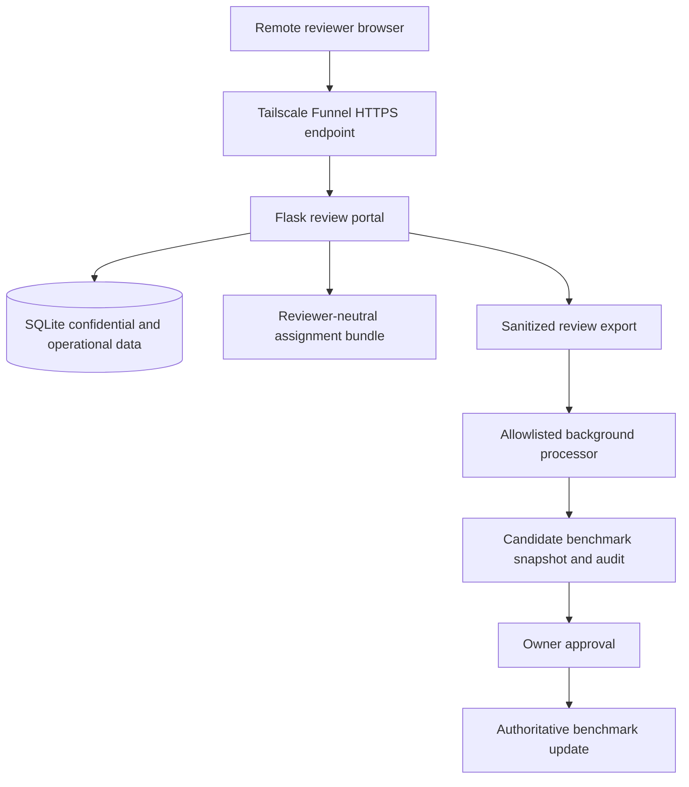

# Musparql v2: remote expert-review platform plan

Status: active phased implementation; isolated deployment bootstrap in progress

Last updated: 2026-08-19

Scope: reviewer administration, remote review, longitudinal expertise data,
controlled processing, and deployment

## 1. What “Musparql v2” means

Musparql v2 is the next operational form of the project. It preserves the
existing benchmark methodology, provenance model, review semantics, and holdout
boundary, while turning the local, file-mediated review workbench into a small
server-backed research application.

This name describes the overall application and workflow. It is independent of
existing artifact version names such as `musparql.review-export.v2`; those
schemas keep their own version histories.

The central change is:

> Reviewers work remotely in an authenticated browser session, while a trusted
> Musparql server identifies them pseudonymously, collects confidential profile
> and expertise information, serves their assignments, receives their reviews,
> and runs narrowly defined post-review processing.

Musparql v2 is a research UI for a small invited pool, not a general-purpose
product or public crowdsourcing platform. The implementation should optimise
for low reviewer friction, strong provenance, comprehensible operation, and a
small maintenance burden.

## 2. Goals

Musparql v2 should:

1. Recognise an invited reviewer by a verified email address without requiring
   a password.
2. Support a pasted email one-time code rather than a magic link.
3. Optionally remember a private browser for a bounded period.
4. Collect general profile and expertise information once and allow later
   correction.
5. Measure KG-specific subject expertise and resource/data-model/KG familiarity immediately before
   each review round.
6. Preserve repeated expertise assessments as longitudinal research data.
7. Avoid asking reviewers to re-enter unchanged information unnecessarily.
8. Keep personal information out of review bundles, review exports, benchmark
   artifacts, logs, prompts, and tests.
9. Let remote reviewers conduct initial and comparative review without access
   to the repository or command line.
10. Replace browser-download-and-manual-file-moving with authenticated review
    submission.
11. Run deterministic, allowlisted post-review processing automatically.
12. Leave an explicit owner approval boundary before an authoritative benchmark
    update is committed or published.
13. Exclude private holdout items from all ordinary remote-review assignments.
14. Support a workshop cohort of up to ten reviewers submitting at approximately
    the same time without lost, duplicated, or partially written work.
15. Run at small scale using Flask, SQLite, and a single application instance.
16. Be deployable in an isolated Musparql WSL environment and reachable through
    Tailscale Funnel without purchasing a domain.

## 3. Non-goals for the first release

The first Musparql v2 release will not:

- support public self-registration;
- use passwords, passkeys, social login, or enterprise single sign-on;
- support many application instances or horizontal scaling;
- put all pipeline artifacts into a database;
- allow reviewers to supply arbitrary repository paths, shell commands,
  endpoints, or processing recipes;
- automatically push to Git, publish a release, or replace an authoritative
  benchmark without owner approval;
- execute SPARQL through the hosted Flask portal in the first release;
- allow ordinary external reviewers to select, see, or re-review holdout items;
- upload private holdout annotations to the ordinary Flask application;
- promise uninterrupted commercial-product availability; or
- reuse, modify, restart, or otherwise operate the Multichannel/VocalLanes
  application or its server resources.

VocalLanes inspection is not permitted. Musparql deployment work must follow
[`HOME_SERVER_BOUNDARY.md`](HOME_SERVER_BOUNDARY.md) and remain scoped to the
dedicated `musparql` Windows account and Musparql WSL environment. It must not
read or change VocalLanes files, processes, credentials, services,
configuration, scheduled tasks, backups, or accounts. If an action could cross
that boundary, stop and ask the owner rather than inspecting the production
application.

## 4. Invariants carried forward from the current system

The following boundaries are not relaxed by the new application:

- Email authenticates a person; `reviewer-NNNN` attributes their review work.
- Reviewer IDs are allocated independently of email addresses. They must never
  be email hashes or other guessable derivatives of identity.
- Only pseudonymous reviewer IDs may cross into review bundles, exports,
  benchmarks, and publication provenance.
- Profile, language, expertise, familiarity, privacy-notice, authentication,
  and session data remain confidential.
- Reviewer activity is derived from review and formulation provenance rather
  than stored as mutable backlink lists on a profile.
- Model output cannot approve a benchmark question or SPARQL correction.
- A review submission is evidence of a human decision; deterministic processing
  validates and stages that decision but does not replace human authority.
- Holdout annotations remain human-only data under the existing holdout policy.
- Agent-facing processing accepts only sanitized non-holdout review exports.

## 5. Proposed system shape



The browser never needs repository access. Flask runs on the machine containing
the trusted Musparql working copy and mediates every permitted operation.

## 6. Reviewer experience

### 6.1 First visit

1. The invited reviewer opens an assignment URL.
2. They enter their email address.
3. The application sends a short-lived numeric code.
4. They paste the code into the same browser.
5. They may select:

   > Keep me signed in for 30 days on this browser. Do not select this on a
   > shared computer.

6. If their profile is incomplete, they complete onboarding.
7. They answer the assignment-specific pre-review questions.
8. The review workbench opens.

### 6.2 Returning on a private browser

If the remembered session remains valid, the assignment opens without another
code. The application asks only for the new round's KG-specific assessments.

### 6.3 Returning on a shared browser

Remembered login is off by default. Reviewers should use a private/incognito
window when practical and sign out after completion. Signing out revokes the
server session and clears its cookie. A “sign out all browsers” action revokes
all remembered sessions for that account.

Authentication recognises a browser profile through a secure cookie. It does
not fingerprint or attempt to recognise the physical computer.

### 6.4 Profile correction

Reviewers can revisit a compact “My profile” page to correct their name,
affiliation, general expertise domains, languages, or other profile answers.
Material changes should be timestamped so the current value and relevant
history can be reconstructed.

## 7. Expertise model

Musparql v2 should distinguish three measurements.

### 7.1 General domain expertise

Collected during onboarding and editable later. Examples include:

- Musicology — expert
- Digital humanities — advanced
- Musical instrument studies — working knowledge

A reviewer can enter multiple domains. This replaces the current single scalar
`domain_expertise` field.

### 7.2 KG-specific subject expertise

Collected before each review round for each KG in the assignment. It asks about
the subject matter needed to interpret that particular KG, for example:

> How would you describe your expertise in pipe organs, organology, organ
> builders, and associated historical records?

This is intentionally more specific than a reviewer's general domain list.

### 7.3 Familiarity with the resource, data model and KG

Also collected before each review round. It asks about direct experience with
the resource, its data, data model and knowledge-graph representation, for
example:

> Before beginning this review, how familiar are you with the Organs Knowledge
> Graph, including its data, data model and knowledge-graph representation?

Subject expertise and familiarity must remain separate. A domain expert can be
unfamiliar with a resource or its model, while a graph engineer can know its
schema without being a subject specialist.

## 8. Controlled-vocabulary recommendation

### 8.1 Recommended approach: assisted vocabulary, not forced classification

General domain expertise should use a hybrid entry control:

- searchable suggestions from a maintained vocabulary;
- multiple domain entries;
- one expertise level per entry;
- free-text entry always available;
- exact reviewer wording always preserved; and
- an optional vocabulary identifier stored only when a suggestion is selected
  or later curated with confidence.

The UI must not require reviewers to browse a large taxonomy tree. Their task is
to describe their expertise, not to perform knowledge-organisation work.

### 8.2 Reference suggestion source: EuroSciVoc

The initial external reference source is the European Science Vocabulary
(EuroSciVoc), maintained by the Publications Office of the European Union:

<https://op.europa.eu/en/web/eu-vocabularies/euroscivoc>

Reasons:

- it covers more than one thousand scientific categories;
- it is substantially more specific than broad statistical classifications;
- it is multilingual;
- it is available in RDF and Turtle;
- it follows Linked Open Data conventions; and
- it is intended as a reference vocabulary for Open Science.

EuroSciVoc is not sufficiently complete for specialist music research. In
particular, reviewers must not be forced to replace fields such as performance
studies, computational musicology, music cognition, music information
retrieval, music computing, or singing research with a broader but less accurate
term.

Musparql should therefore not present EuroSciVoc as the boundary of the domain
list or depend on a live EuroSciVoc service during onboarding. It should retain
a small, versioned local suggestion set containing relevant EuroSciVoc entries
and owner-reviewed project terms. For vocabulary entries, cache preferred
labels, alternative labels, concept URIs, languages, and broader concepts. This
keeps the UI responsive, makes historical interpretation reproducible, and
allows a specialist local term to be promoted to a suggestion without falsely
claiming that it belongs to EuroSciVoc.

Other scholarly infrastructures do not supply a better general replacement:

- ORKG uses its own community-maintained hierarchy of research-field resources.
  It includes useful headings such as Musicology and Theatre and Performance
  Studies, but its live hierarchy mixes levels of specificity and contains
  independently added roots, so it is unsuitable as the authoritative source.
- GoTriple uses 27 broad MORESS-based SSH disciplines and a separate multilingual
  TRIPLE subject vocabulary aligned with sources including Library of Congress
  Subject Headings. It is valuable for SSH resource discovery but is too broad
  and SSH-specific to govern reviewer self-description. Individual terms may be
  considered for the local suggestion set only after owner review.
- OpenCitations Meta describes bibliographic and citation metadata and does not
  expose a subject-domain classification suitable for this control.

### 8.3 Optional broad mapping: OECD FORD

The OECD Fields of Research and Development classification may be retained as
an optional broad analytical mapping. It is an OECD classification from the
Frascati Manual, not a UNESCO taxonomy. The former UNESCO UIS glossary page is
no longer a reliable entry point; use the OECD publication page:

<https://www.oecd.org/en/publications/frascati-manual-2015_9789264239012-en.html>

FORD's top-level areas, such as “Humanities and the arts,” are too coarse to be
the primary reviewer control. Musparql v2 will not implement FORD mapping in
Phase 1. It may be reconsidered later if aggregate reporting or cross-project
comparison creates a concrete need. Deferral loses no reviewer evidence because
any later mapping can be curated from the preserved domain assertions.

### 8.4 Free-text domains

Free text is required because:

- specialist fields may not appear in EuroSciVoc;
- reviewers may identify with interdisciplinary or historically specific
  terminology;
- a controlled label may be technically present but pragmatically wrong; and
- forced classification can distort the evidence about who the reviewer is.

For each domain, store:

```text
entered_label              exact reviewer-supplied or selected label
normalized_label           conservative search/display normalization
vocabulary_name            for example euroscivoc, or null
vocabulary_concept_uri     stable concept URI, or null
vocabulary_version         local snapshot/version identifier, or null
expertise_level            ordinal self-assessment
first_asserted_at          initial assertion time
updated_at                 latest change time
```

Do not overwrite `entered_label` during later normalization. Do not merge two
reviewer-entered domains automatically. Owner curation may add a mapping while
preserving the original assertion.

### 8.5 Initial suggestion set

The first suggestion set should be deliberately small and informed by the KGs
actually present in Musparql. It can contain relevant EuroSciVoc concepts plus
carefully chosen project-specific labels. Reviewers should search suggestions
as they type and use “Add as written” when none is suitable.

The initial set should be reviewed by the project owner before deployment. It
should not be generated blindly from ontology class names.

### 8.6 KG-specific domains are project-authored, not vocabulary-controlled

The domain prompt attached to a KG should be plain language written for that
specific review task. A controlled-vocabulary concept may optionally accompany
it for internal analysis, but it must not constrain the question shown to the
reviewer.

Proposed seed shape:

```yaml
review_domains:
  - domain_id: "pipe-organs-organology"
    label: "Pipe organs and organology"
    description: >
      Pipe organs, organ builders, instruments, specifications, places,
      institutions, and associated historical records.
    vocabulary_mappings:
      - vocabulary: "euroscivoc"
        concept_uri: "<optional URI after human verification>"
familiarity_scopes:
  - scope_id: "organs"
    label: "Polifonia Organs Knowledge Graph"
    kind: "knowledge_graph"
```

Every remotely reviewable KG must declare one or more `review_domains` in its
seed alongside the graph description. The seed is the authoritative research
contract: all listed domains are asked once before an assignment for that KG.
The application does not inspect SPARQL `GRAPH` clauses or discover expertise
domains at runtime. A simple KG normally declares one entry under
`familiarity_scopes`; a federation can declare its component resources and the
federation itself. Domain IDs, labels and descriptions are required; vocabulary
mappings are optional and must be human-verified.

Owner-approved initial prompts:

- `organs` — **Pipe organs and organology.** Pipe organs, their builders,
  components and specifications, construction and modification events,
  locations and institutions, and associated historical and heritage records.
- `meetups` — **Historical musical encounters and events.** Documented
  encounters and collaborations in music history; the people and roles involved;
  their places, dates and purposes; and the biographical evidence used to
  describe them. The papers frame the intended scope as European musical culture
  “across Europe” from c. 1800 to 1945, not Western Europe specifically.
  However, the released corpus includes Eastern European, American and Latin
  American figures, and its extracted evidence includes non-European places and
  events after 1945. Treat the nominal European period as source provenance, not
  as the expertise boundary or a claim of balanced geographic coverage.
- `musow` — **Digital music research resources available online.** Online
  catalogues, digital libraries and repositories, datasets, linked open data,
  digital editions, services and software, schemas, ontologies, formats and
  symbolic-music resources included in the musoW survey.
- `musicbo` — **Bologna's musical heritage.** Composers, musical works,
  performances, archival sources, institutions and places associated with
  Bologna's musical history.
- `jazzontology` — **Jazz discography and performance.** Jazz musicians,
  instruments, performances, recording sessions, recordings, solos, tracks,
  releases and the discographic evidence used to document them.

`linkedmusic` is an integration resource, not one coherent subject domain. Its
seed should declare these five domains:

- **Medieval European music manuscripts**
- **Jazz discography and performance**
- **Traditional, Indigenous, folk and popular song worldwide; cross-cultural
  comparative music analysis**
- **Recorded music discography**
- **Irish traditional music**

The seed should also declare six familiarity scopes: DIAMM, Dig That Lick, The
Global Jukebox, MusicBrainz, The Session, and the LinkedMusic federation itself.
Each scope receives one broadened familiarity rating covering the resource, its
data, its data model and its knowledge-graph representation. These are not
separate ratings for source data and graph representation.

Some queries additionally use Wikidata as a lookup service. This does not create
a separate subject-expertise question.

### 8.7 Federated, broad and general-purpose graphs

Approved policy:

1. Attach expertise to the bounded subject domains declared in the KG seed, not
   to the endpoint, platform, graph brand or individual query.
2. Ask about every domain listed for the assigned KG once before the assignment.
   A federated or broad KG may therefore present several upfront domain questions.
3. Do not infer domains from named-graph IRIs or inspect queries to decide which
   expertise questions to show.
4. Keep familiarity separate from subject expertise. A simple KG normally has
   one familiarity scope. A federation may declare its components plus the
   federation itself as separate scopes. LinkedMusic therefore has five
   subject-domain assessments and six familiarity assessments.
5. Wikidata, Europeana or another general graph used for identifiers, labels,
   reconciliation or incidental enrichment adds no expertise domain. Record the
   dependency in query provenance only.
6. If a broad graph is itself a Musparql source, its seed must declare the bounded
   subject domains represented by the selected query collection. Never ask for
   generic “Wikidata expertise” or “Europeana expertise.”
7. If no defensible bounded domains can be declared, exclude that KG or query
   collection from expertise-stratified review rather than assigning a
   meaningless general expertise score.

Federation evolution remains an open methodological issue. The system does not
learn a new domain automatically when a federation adds a named graph. A human
must update and approve a new version of the KG seed before the new domain enters
review. The complete seed is appended to `catalog/kg_seed_snapshots.yaml`, where
its canonical digest links to the preceding version. Each assignment records the
seed version and digest it used, so existing assignments resolve their original
labels and descriptions without depending on the mutable current seed or Git
history. Reusing a version with changed content, branching the digest history, or
referencing a non-head current seed is rejected. Whether Musparql should monitor
federations for unrecorded named graphs, and whether the underlying KG data must
also be frozen, remain separate open questions.

## 9. Assessment scales

The final wording should be piloted with at least one synthetic or trusted
reviewer before collection. The recommended scales are below.

### 9.1 Subject expertise

Use one stable five-level scale for both general domain expertise and
assignment-specific subject expertise:

| Stored value | Reviewer-facing label | Suggested explanation |
|---|---|---|
| `none` | 0 — None | No meaningful prior knowledge of this subject. |
| `basic` | 1 — Basic | General awareness or limited informal exposure. |
| `working` | 2 — Working knowledge | Enough study or practice to work with ordinary material in the area. |
| `advanced` | 3 — Advanced | Substantial research or professional experience. |
| `expert` | 4 — Expert | Deep specialist knowledge or recognised contribution to the area. |

Show the complete 0–4 scale, including `0 — None`, for both onboarding domain
entries and KG-specific subject assessment. Displaying the lower anchor makes
the measurement explicit and discourages reviewers from inventing unnecessary
granularity at the expert end. Store the semantic value rather than relying on
the number alone; the displayed number is its stable ordinal.

The existing `none`, `occasional`, `regular`, and `expert` experience enum
should not silently be reused. Musparql v2 needs a documented migration or an
explicit legacy mapping because “occasional” and “regular” measure frequency
more naturally than expertise.

### 9.2 Resource, data-model and KG familiarity

Use one broadened question for each familiarity scope:

> Before beginning this review, how familiar are you with [resource], including
> its data, data model and knowledge-graph representation?

For a federation-level scope, use:

> Before beginning this review, how familiar are you with [federation] as a
> federation, including its integrated data, data model, named graphs and
> cross-graph query environment?

Use this five-stage progression:

| Stored value | Reviewer-facing label | Suggested explanation |
|---|---|---|
| `none` | Not previously familiar | I had no meaningful prior familiarity with the resource, its data or its graph representation. |
| `inspected` | Inspected / browsed | I have browsed the resource or inspected its data, documentation, ontology or data model. |
| `worked` | Worked with / queried | I have worked with its data or written or examined queries against it. |
| `regular_user` | Regular user / maintainer | I use or maintain the resource, data or graph repeatedly in my work. |
| `creator` | Creator / core contributor | I created it or made substantial contributions to its source data, design, model or graph representation. |

These categories are ordered operationally, but `creator` should not be treated
as proof of subject expertise. The two measures remain analytically separate.

## 10. Repeated pre-review assessment

KG-specific subject expertise and declared familiarity scopes should be recorded
before every assignment or review round, before review items are shown.

For a first assessment, the application should show blank controls. For a
returning reviewer, it should preselect the most recent answers and ask:

> Have any of these changed since your previous assessment?

The reviewer can change any answer or confirm that they are unchanged. A single
“Confirm and continue” action records a new timestamped assessment even when the
values are unchanged. Add a short note:

> You can update these answers later from your profile page.

Profile-page changes must create another timestamped assertion; they must not
overwrite the assessment that applied before an earlier review. The next
pre-review screen uses the most recent profile or pre-review assertion as its
default and asks for confirmation again.

This design:

- acknowledges that reviewing a KG increases familiarity;
- supports longitudinal analysis;
- avoids making reviewers reconstruct previous answers;
- costs only a few seconds per KG per round; and
- records the state that applied before the new review work began.

Showing the previous value may create some anchoring. The project accepts that
trade-off initially in favour of low friction. If independent re-measurement
later becomes a research objective, a study-specific assignment can hide the
previous values.

## 11. Proposed confidential and operational data model

Table and column names remain provisional until schema implementation.

### 11.1 `reviewers`

```text
id                          reviewer-NNNN primary key
name
affiliation
email_display               original verified spelling
email_normalized            unique login lookup value
status                      invited, active, disabled, withdrawn
disabled_from_status        nullable; invited or active while status is disabled
created_at
updated_at
privacy_notice_version
privacy_notice_acknowledged_at
```

Email changes require verification before replacing the login identity. Email
normalization must be conservative; the original address remains preserved.

### 11.2 `reviewer_experience`

```text
reviewer_id
kg_ontology_experience
sparql_experience
nlp_llm_experience
assessed_at
```

These general technical experience fields remain separate from subject-domain
expertise.

### 11.3 `reviewer_languages`

```text
reviewer_id
language_tag
level                       basic, advanced, fluent, native
first_asserted_at
updated_at
```

### 11.4 `expertise_domains`

```text
id                          internal opaque ID
entered_label
normalized_label
vocabulary_name             nullable
vocabulary_concept_uri      nullable
vocabulary_version          nullable
created_by                  reviewer or owner-curation source
```

### 11.5 `reviewer_domain_expertise`

```text
id
reviewer_id
domain_id
expertise_level
asserted_at
supersedes_id               nullable link to earlier assertion
```

The current value is the latest non-retired assertion; earlier assertions are
retained for research provenance.

The serialized v2 profile is explicitly a current-state projection. Each
projected domain carries its stable `domain_id` and latest `assertion_id`; the
append-only source of truth uses
`schemas/reviewer_domain_expertise_assertion.schema.json`. Its collection
validator requires one chronological, non-branching supersession chain per
reviewer/domain. Phase 2 normalizes the repeated label and vocabulary fields into
`expertise_domains` while retaining every assertion event.

### 11.6 `login_codes`

```text
id
email_normalized
code_hash
requested_at
expires_at
consumed_at                 nullable
failed_attempt_count
request_context_digest      privacy-preserving abuse-control metadata
```

Codes are numeric, single-use, short-lived, stored only as hashes, rate-limited,
and never written to logs. Login responses must not reveal whether an email is
registered.

### 11.7 `auth_sessions`

```text
id                          random opaque server-side session ID
reviewer_id
token_hash
created_at
last_used_at
expires_at
revoked_at                  nullable
remembered                  boolean
```

The browser receives an opaque `Secure`, `HttpOnly`, `SameSite` cookie. It does
not receive a reusable token in `localStorage`.

### 11.8 `review_assignments`

```text
id
reviewer_id
mode                        initial, compare; sparql_correction is reserved for
                            a later hosted recipe and is not currently accepted
status                      draft, ready, active, submitted, processing,
                            ready_for_owner_review, approved, failed
bundle_path
bundle_digest
previous_benchmark_path     nullable
processing_recipe
holdout_capability          false for ordinary remote review
kg_seed_versions            mapping of assigned kg_id to frozen seed version
kg_seed_digests             mapping of assigned kg_id to archived seed digest
created_at
opened_at                   nullable
submitted_at                nullable
```

Assignment paths and recipes are selected by trusted server code or an owner
control. They are never accepted verbatim from a reviewer request.

### 11.9a `reviewer_kg_domain_assessments`

```text
id
reviewer_id
kg_id
review_domain_id
review_domain_label         confidential snapshot of the prompt shown
subject_expertise_level
assessed_at
context                     pre_review, profile
assignment_id               required for pre_review; null for profile
seed_version
previous_assessment_id      nullable
```

One row is recorded for every domain declared by the assigned KG seed.
The complete label and description shown are recoverable from the immutable
snapshot selected by `kg_id`, `seed_version`, and the assignment's seed digest.

### 11.9b `reviewer_resource_familiarity_assessments`

```text
id
reviewer_id
kg_id
familiarity_scope_id
familiarity_scope_label     confidential snapshot of the resource shown
familiarity_level
assessed_at
context                     pre_review, profile
assignment_id               required for pre_review; null for profile
seed_version
previous_assessment_id      nullable
```

One familiarity row is recorded for every scope declared by the assigned KG
seed. A simple KG normally declares one scope; LinkedMusic declares its five
current component resources and the federation. Both assessment tables are
confidential. They do not enter the bundle, submitted review export, benchmark,
or public provenance. Profile updates append new rows and never overwrite earlier
assessments.

Both assessment collections enforce predecessor existence, matching reviewer
and assessment subject, strictly increasing timestamps, a single root and head,
and no branches, cycles, or disconnected records. Phase 2 must repeat these
invariants with foreign keys, uniqueness constraints, and transactional writes.

### 11.10 `review_submissions`

```text
id
assignment_id
reviewer_id
export_path
export_digest
submitted_at
revision
validation_status
```

The server derives `export_path`; the browser cannot choose it.

### 11.11 `processing_jobs`

```text
id
assignment_id
submission_id
recipe
status                      queued, running, succeeded, failed
created_at
started_at                  nullable
finished_at                 nullable
safe_summary                nullable
candidate_output_path       nullable
```

Detailed logs must be bounded and scrubbed. They must not contain reviewer
profiles, authentication values, secrets, private holdout annotations, or
arbitrary environment dumps.

## 12. Why SQLite is sufficient

SQLite is the preferred first database because Musparql v2 has a small reviewer
pool, low write concurrency, one trusted application instance, and modest data
volume.

Required operating choices:

- SQLAlchemy for application access;
- Alembic for migrations;
- foreign keys enabled;
- WAL mode;
- short transactions;
- atomic file submission alongside transactional database registration;
- a dedicated application user;
- encrypted disk storage;
- automatic encrypted backups; and
- a tested restoration procedure.

Postgres should be reconsidered only if Musparql moves to multiple application
instances, a platform with an ephemeral filesystem, materially higher
concurrency, or a managed-database operational model.

The move to SQLite applies to confidential reviewer administration and portal
operations. Generated bundles, sanitized exports, benchmark snapshots, run
manifests, and publication artifacts remain files with explicit schemas and
digests.

### 12.1 Workshop concurrency target

The initial capacity target is ten reviewers working concurrently and
submitting within the same short end-of-workshop interval. This does not require
Postgres or a distributed queue.

Submission requests must do only bounded foreground work: authenticate the
reviewer, check the assignment and payload envelope, validate the review,
calculate its digest, perform an atomic file write, register a short SQLite
transaction, and enqueue processing. Each reviewer should receive a durable
submission receipt without waiting for benchmark construction or audits.

SQLite may serialize the brief registration transactions. At this scale those
writes should complete quickly, while the heavier jobs wait in a persistent
queue and run one at a time. The queue protects the repository and avoids ten
simultaneous benchmark builds; it is not needed because SQLite cannot accept
ten submissions.

Before a workshop, an end-to-end load test must simulate at least ten distinct
reviewers submitting valid assignments concurrently. It must verify:

- every accepted submission has exactly one durable file and database record;
- each reviewer receives a unique receipt;
- duplicate retries are idempotent or create an explicit new revision;
- queued processing survives an application restart;
- one failed job does not block later jobs; and
- reviewer-facing submission requests remain responsive while processing is
  underway.

Concurrent submissions must never incrementally mutate one shared candidate
benchmark. Each accepted submission is stored, registered, validated, and
processed in its own staging namespace. Per-submission candidate previews may
be built there, but they are provisional. For a workshop or other review batch,
the system deterministically builds one combined candidate from an immutable
declared baseline and the exact set of submission revisions selected by the
owner. Heavy processing remains serialized through the persistent queue, so a
burst of receipts cannot create competing writes or a lost-update race in the
next benchmark.

## 13. Assignment and bundle design

### 13.1 Reviewer-neutral bundles

Current bundles contain `reviewer_id`. Musparql v2 should generate or retain a
reviewer-neutral bundle on disk. Flask combines the authenticated assignment
with the bundle in memory and supplies only the permitted pseudonymous ID to
the workbench.

The server must ignore or reject a browser-supplied conflicting identity. A
reviewer cannot change attribution by editing a request payload.

### 13.2 Assignment preparation

The owner selects:

- reviewer;
- initial, comparative, or correction mode;
- source generation run or bundle;
- previous benchmark and sanitized prior-review inputs;
- included KGs and queries;
- complete-review-provenance assertion where applicable;
- processing recipe.

Ordinary remote assignments always set `holdout_capability: false` and are built
after holdout identities have been filtered according to the existing policy.

### 13.3 Browser draft state

For the first release, review decisions may continue to use browser local
storage namespaced by assignment, dataset, and authenticated reviewer ID. The
server must never serve another reviewer's namespace.

Once external reviewers cannot encounter or create holdouts, server-side draft
autosave may be added safely for those assignments. It should be a later,
explicit phase rather than bundled into the first authentication change.

## 14. Submission instead of browser file-moving

“Export Non-Holdout” becomes “Submit review” for ordinary remote assignments.

Submission processing is:

1. Require an authenticated active assignment.
2. Apply request-size and content-type limits.
3. Partition or reject any private/holdout marker before accepting the payload.
4. Validate the canonical export schema.
5. Validate assignment, reviewer, bundle, dataset, run, and event provenance.
6. Stamp or confirm the authenticated `reviewer-NNNN` server-side.
7. Compute an authoritative digest.
8. Write to a temporary file under the server-controlled export directory.
9. Flush and atomically rename to the final assignment-derived filename.
10. Register the submission and digest transactionally.
11. Enqueue the fixed processing recipe.
12. Return a submission receipt and visible job status.

The reviewer may optionally download a copy, but repository placement no longer
depends on their browser or computer.

Benchmark construction, snapshot auditing, and other substantial work must not
run inside the submission request. They begin only after the receipt is durable.
This keeps a burst of workshop submissions short and independent: reviewers do
not wait for earlier processing jobs, and a later processing failure cannot
erase an accepted submission.

The canonical export schemas are strict at both the envelope and individual
review/annotation levels. Fields not declared by the applicable versioned schema
and unknown enum values are rejected rather than ignored. Free text is permitted
only in fields that explicitly allow it. Adding a legitimate field requires an
artifact schema version change and browser/Python parity tests. This prevents
misspelled fields, browser-only controls, debugging metadata, or personal data
from silently entering durable submissions.

## 15. Automated post-review processing

### 15.1 Processing recipes

The initial allowlist should contain only:

```text
validate_initial_review
stage_initial_benchmark_update
validate_comparative_review
stage_comparative_benchmark_update
```

A request identifies an existing assignment; it does not contain a command
line. The worker resolves all paths and arguments from trusted assignment data.

### 15.2 Candidate output

Automatic processing may:

- validate the submission;
- stage the appropriate benchmark build/update;
- run snapshot audits;
- run targeted tests;
- calculate a concise change summary;
- produce an owner-readable diff; and
- mark the assignment ready for owner review.

It should write candidate outputs to a staging location until approved. It must
not silently replace `benchmark/vN`, choose a version ambiguously, commit to Git,
push, or publish a release.

### 15.3 Owner approval

The owner dashboard should show:

- reviewer pseudonym and assignment;
- reviewed, accepted, excluded, and improvement counts;
- validation and audit status;
- candidate snapshot path;
- benchmark diff summary;
- safe failures and remediation guidance; and
- explicit submission-inclusion and candidate-promotion actions.

Owner control has two distinct gates.

At the submission-inclusion gate, the default decision applies to the whole
assignment revision. The owner may:

- include every eligible review event or annotation in the candidate;
- include the assignment with item-level overrides;
- request a revision of the whole assignment; or
- reject the whole submission from the candidate.

Item-level overrides attach to the specific review event or linguistic trial,
not merely to its KG/query pair, because several reviewers may assess the same
pair. An item may be **included in the candidate**, **omitted from the
candidate** without further reviewer action, or **sent for revision**. The UI
must not call the owner-level omission action "exclude", because exclusion is
also a reviewer-authored benchmark disposition with different meaning. Every
omission or revision request requires a concise reason and an audit record.

Sending work for revision is not an owner editing or overwriting the review.
The original submission remains immutable; already included items do not need
to be repeated; and the reviewer receives a revision assignment containing only
the flagged items and the owner's reason. A response creates a new numbered
submission revision and new review-event identifiers linked to the originals.
The owner then explicitly selects which revisions enter the combined candidate.

Linguistic annotations have a stricter cognition-study boundary. An unusable
observation may be omitted, and an objective correction may be appended with
the original and revised value, reason, actor, and timestamp. A genuine re-rating
after later stimuli is a new observation or separately designated round, never
a replacement for the original observation.

At the candidate-promotion gate, the dashboard presents the combined candidate,
its exact selected submission revisions, audits, tests, summary, and diff. The
owner may approve it for atomic local promotion or reject it for rebuilding.
Approval therefore means that the selected reviewer data may enter that next
benchmark candidate; schema and provenance validation establish technical
soundness but do not make the scientific inclusion judgment on the owner's
behalf.

The first release may leave final Git operations manual. A later phase may add
an owner-only “create branch and commit” action after the workflow has proved
reliable. Automatic push and publication remain out of scope unless separately
authorised and designed.

## 16. Deferred option: SPARQL execution from the browser

Hosted SPARQL execution is not part of the first Musparql v2 release. Workshop
review is annotation-only, and reviewers submitting in parallel will not send
queries through Flask. The existing local correction service remains the
appropriate execution interface for the owner.

If remote execution becomes useful later, Flask could expose the correction
workbench's non-mutating execution capability as a separately approved phase.
The following constraints are retained as future design requirements rather
than current implementation work.

The browser requests execution for an assignment record and target such as
`base`, `proposal`, or `latest_approved`. The server resolves the authoritative
query and endpoint. It must enforce:

- authenticated assignment membership;
- candidate and bundle digest checks;
- holdout exclusion before evidence or endpoint access;
- an endpoint allowlist from trusted KG configuration;
- no browser-supplied arbitrary endpoint URL;
- query timeout;
- response-byte and row limits;
- bounded concurrency, preferably one active observation per KG;
- safe projection of returned data;
- credential and internal-path redaction; and
- append-only execution provenance where required.

Execution success remains an observation, not approval of a question or query.

## 17. Holdout approach for Musparql v2

The first release deliberately narrows remote-review authority:

- external reviewers cannot add items to the holdout;
- external reviewers cannot review or re-review existing holdout items;
- remote bundles exclude selected holdout identities upstream;
- the hosted workbench does not render a holdout control;
- the submission API rejects private or holdout-bearing payloads; and
- ordinary server draft/autosave data are therefore non-holdout by construction.

The owner retains the existing local, human-controlled holdout workflow. Its
private annotations do not enter the Flask database, submission directory,
processing queue, logs, backups, or ordinary server administration.

If policy later permits a handful of designated holdout reviewers, that is a
new security phase. It requires an explicit role, separate assignment path,
separate encrypted storage, revised privacy and threat analysis, and new tests.
It must not be implemented by merely revealing the hidden checkbox.

## 18. Authentication and session design

### 18.1 Email code

- Invite-only email addresses.
- Numeric copyable code.
- Single use.
- Expires after 15 minutes.
- Request throttling per address and request context.
- Attempt limit per code.
- Requesting a replacement invalidates the older code.
- Constant outward response whether or not the address is invited.
- Hashed storage only.
- No codes, email bodies, or secrets in logs.

The email delivery mechanism remains an implementation prerequisite. The
preferred no-new-domain route is an ICF-managed project address or alias using
an ICF-approved sending service. If ICF cannot provide one, the fallback is a
dedicated free Musparql `@gmail.com` account sent through the Gmail API with
OAuth restricted to the narrow send-only scope. The exact available address is
chosen when the account is provisioned. It should be human-readable, such as
`musparql.review@gmail.com`, and monitored for reviewer replies, bounces, and
account-security notices; `noreply` wording does not technically prevent
replies and is not preferred for the small invited cohort.

This is deliberately separate from reviewer authentication: reviewers still
sign into Musparql using the emailed code, not Google OAuth. The sender is
implemented behind an adapter so a verified-domain transactional provider can
replace Gmail later without changing authentication or stored reviewer data.

If neither the ICF route nor the Gmail fallback proves operationally suitable,
preferred replacement options, in order of operational simplicity, are:

1. an existing institutional transactional SMTP service that permits this use;
2. a dedicated transactional-email provider; or
3. a small managed authentication provider if email delivery cannot be operated
   responsibly in Flask.

The project must not embed a personal mailbox password. It uses a dedicated
account and scoped OAuth credential, stored outside Git, with documented
revocation and rotation. The application does not request inbox-reading scope;
bounces and replies are monitored manually in the dedicated mailbox. Sent
authentication messages are removed within 30 days, and resolved replies or
bounces within 90 days unless the controller approves a different schedule.

### 18.2 Browser sessions

- Server-side, random, revocable sessions.
- Cookie contains only an opaque value.
- `Secure`, `HttpOnly`, and explicit `SameSite` configuration.
- Non-remembered reviewer sessions expire after two hours of inactivity and
  have an absolute lifetime of 24 hours; the browser-session cookie also ends
  when the browser session closes.
- Remembered reviewer sessions expire after seven days of inactivity and have
  an absolute lifetime of 30 days.
- Owner sessions expire after two hours of inactivity and have an absolute
  lifetime of 12 hours.
- Session rotation after successful login.
- Logout, logout-all, and owner revocation.
- Reverification for email changes and sensitive profile operations where
  appropriate.
- Browser activity means an authenticated server request, not an idle open tab.
- Invitation, disable, restoration, and deletion actions require recent owner
  authentication.

## 19. Privacy and security requirements

Before collecting real profiles, the project must document:

- controller identity and contact route;
- processing purposes;
- lawful basis;
- fields collected;
- retention and deletion periods;
- access, correction, withdrawal, and deletion procedures;
- recipients and processors;
- international transfers and safeguards;
- hosting and backup locations;
- incident response; and
- whether acknowledgement is merely notice acknowledgement or legal consent.

The working factual assessment, proposed retention schedule, rights-request and
incident procedures, and approval questions for ICF are recorded in
[`REVIEWER_DATA_GOVERNANCE_DRAFT.md`](REVIEWER_DATA_GOVERNANCE_DRAFT.md). ICF is
the provisional controller because the work is paid research under ICF and an
EU grant, but this is not final: ICF must confirm the controller, lawful basis,
home-server and provider approvals, and final notice before real-data
collection. ODOMA currently receives and processes no Musparql personal data;
any future data, authentication, code, or contributor integration triggers a
new controller/processor and notice review before it begins.

The notice must disclose relevant processors used for hosting, tunnelling, email
delivery, monitoring, and backups.

Application controls include:

- CSRF protection for state-changing browser requests;
- strict origin and host validation;
- security headers and a restrictive Content Security Policy;
- HTTPS-only production cookies;
- bounded request sizes;
- output escaping;
- no sensitive query parameters;
- no profile data in analytics;
- redacted operational logs;
- least-privilege filesystem permissions;
- secrets outside Git;
- dependency update procedure;
- database backup and restore testing; and
- a documented account disable/delete procedure.

## 20. Deployment plan

### 20.1 Development

Develop and test Musparql v2 in the existing Musparql workspace first. No home
server or VocalLanes operation is required during the application-development
phases.

### 20.2 Dedicated WSL environment

The server environment is a new WSL2 distribution named `MusparqlReview`,
installed and operated under the Windows account `musparql`, containing:

- its own unprivileged Linux user;
- its own Musparql clone;
- its own virtual environment;
- its own SQLite and backup paths;
- Gunicorn serving Flask;
- a separate background-worker service;
- Tailscale and Funnel confined to the environment where supported;
- explicit service ports; and
- no mounts, credentials, paths, or service dependencies belonging to
  VocalLanes.

A separate WSL distribution is useful operational isolation but not a complete
security boundary. Both applications still share the Windows host, physical
CPU, memory, disk, networking, update cycle, and power supply. If this residual
risk proves unacceptable, deploy the same single-instance Flask and SQLite
application to a separate small VM or VPS.

#### 20.2.1 Provisioning state on 2026-08-19

The isolation bootstrap is complete:

- Windows account `DANIEL-PC\musparql` is the sole Windows owner of Musparql;
- WSL2 distro `MusparqlReview` was imported under that account from a
  SHA-256-verified Canonical Ubuntu 24.04 WSL image;
- unprivileged Linux user `musparql` is the distro default;
- systemd was verified as PID 1;
- the minimal Python 3.12, virtual-environment, Git, TLS, and SSH runtime is
  installed only in `MusparqlReview`;
- a dedicated Ed25519 key exists only inside the distro, and the owner added its
  public key to `ppquadrat/musparql-aligner` as a read-only deploy key;
- `\Musparql WSL Keepalive` runs at Windows boot and
  `\Musparql WSL Keepalive Watchdog` runs every five minutes;
- both tasks run as stored-password Windows principal
  `DANIEL-PC\musparql`, at limited privilege, and invoke only
  `MusparqlReview` as unprivileged Linux user `musparql`;
- both tasks use unlimited execution time and `IgnoreNew`; and
- the boot keepalive was manually verified `Running` with Task Scheduler result
  `267009`; the watchdog was also manually verified `Running`, with a redundant
  start correctly refused by `IgnoreNew` as `0x800710E0`.

The exact operational boundary, repeat-provisioning procedure, and evidence log
are in [`HOME_SERVER_BOUNDARY.md`](HOME_SERVER_BOUNDARY.md) and
[`HOME_SERVER_PROVISIONING_LOG.md`](HOME_SERVER_PROVISIONING_LOG.md). Those
documents are mandatory before any server work. There is no read-only exception
for VocalLanes inspection.

Still outstanding are in-distro Git verification and clone, the application
and worker units, the distro-local tunnel, the independent encrypted backup and
restore test, monitoring, and an owner-approved reboot test.

### 20.3 Public address

Tailscale Funnel can supply a public HTTPS address under the tailnet's `ts.net`
domain, for example:

```text
https://musparql-review.<tailnet>.ts.net
```

No purchased domain or reviewer-side Tailscale installation is required.
Funnel provides connectivity and TLS, not application authentication. Flask's
email-code and session controls remain mandatory.

Tailscale currently documents Funnel as beta. Before inviting real reviewers,
the project must verify its current limits, acceptable-use terms, stability, and
fit for the expected low traffic.

### 20.4 Restart and availability

The deployment is ready only when:

- Windows security updates are current;
- Linux security updates are current;
- disk encryption is enabled;
- SSH uses keys;
- Flask is not running in debug mode;
- services run unprivileged;
- no router port forwarding exposes Flask, WSL, or SSH;
- the dedicated WSL distribution starts after Windows boot;
- Flask, the worker, and Funnel restart automatically;
- a deliberate Windows reboot has been tested;
- disk space and service health are monitored;
- automatic encrypted database backups run;
- restoration from backup has been tested; and
- temporary unavailability has an owner-visible alert and reviewer-friendly
  message.

The keepalive bootstrap satisfies only the task-creation and manual-start part
of this gate. It does not establish reboot recovery until a deliberate Windows
reboot has been observed, and it does not establish application availability
until the real `musparql-*` systemd units and tunnel exist.

## 21. Migration and compatibility

### 21.1 Confidential reviewer data

The documented confidential JSONL registry was confirmed never to have been
populated. Phase 2 therefore starts directly with the v2 SQLite model and does
not introduce legacy-value tables or infer mappings between incompatible scales.
Alembic schema upgrades and database checks print only schema versions, counts,
and pseudonymous reviewer IDs. If an unexpected legacy registry is discovered
later, stop rather than importing or reinterpreting it; the owner must define a
separate, explicit migration policy first.

### 21.2 Existing browser review artifacts

Existing bundles and sanitized exports remain readable during transition.
Reviewer-specific bundle generation may remain available as a local legacy
path until all ordinary review is assignment-backed.

### 21.3 Schema versioning

Changes to reviewer profiles, domain expertise, repeated assessments,
assignments, and exports require independent version identifiers. “Musparql v2”
must not be used as a substitute for artifact-specific schema versions.

## 22. Implementation phases and gates

Each phase should be completed, reviewed, and tested before beginning the next.

### Phase 0 — approve research and governance decisions

Work:

- approve the three-part expertise model;
- approve assessment scales and wording;
- approve the EuroSciVoc-assisted/free-text strategy;
- define controller, lawful basis, retention, rights, backup, and processors;
- choose the login-code email delivery method; and
- decide the exact owner approval boundary.

Exit criteria:

- no unresolved field or privacy decision blocks schema implementation;
- the reviewer-facing wording is recorded; and
- real reviewer data will not be collected prematurely.

### Phase 1 — schemas and KG review domains

Status: completed on 2026-08-18. The tracked implementation consists of the v2
current-profile projection, append-only general-expertise assertion contract,
and repeated-assessment schemas, with synthetic examples and Python validators;
versioned review domains and familiarity scopes in `catalog/seeds.yaml`; the
digest-linked immutable seed archive; the versioned local expertise suggestion
snapshot; and the corresponding data-model and privacy documentation. Legacy
confidential registry contracts remain explicit inputs to the owner-run Phase 2
migration.

Work:

- replace scalar general domain expertise with repeatable domain assertions;
- separate the current profile projection from append-only expertise history;
- create repeated assignment assessment schemas;
- define repeatable `review_domains` and `familiarity_scopes` in the versioned KG
  seed contract;
- add reviewed domain descriptions for every initially eligible KG;
- add vocabulary snapshot metadata;
- archive every complete seed version with a canonical digest and predecessor;
- validate assertion and assessment predecessor chains; and
- update validators, data-model documentation, and synthetic tests.

Exit criteria:

- all relevant schemas and runtime validators have consistent synthetic examples;
- Draft 2020-12 schemas execute with format checking and local reference
  resolution in the test suite;
- every current seed equals the unique head of its immutable archive;
- append-only histories reject dangling, cross-subject, non-chronological,
  branching, cyclic, and disconnected predecessor links;
- every pilot KG has an owner-approved prompt; and
- no personal field can enter a public artifact.

### Phase 2 — SQLite foundation and migration

Status: completed on 2026-08-18. The tracked implementation introduces
SQLAlchemy models, an explicit Alembic revision, SQLite foreign-key/WAL/full-sync
configuration, normalized immutable seed snapshots and prompt scopes,
repository/service boundaries, append-only provenance services and database
triggers, pseudonymous schema diagnostics, and synthetic migration, constraint,
atomicity, and ten-writer concurrency tests. The documented legacy registry was
confirmed absent, so no legacy values were migrated or reinterpreted. Backup and
recovery were moved by owner decision to Phase 2b.

Work:

- introduce SQLAlchemy and Alembic;
- create confidential and operational tables;
- enforce seed-digest references and append-only assertion/assessment chains
  with database constraints and transactional writes;
- implement repository/service boundaries;
- record that the documented legacy registry was never populated and start with
  the v2 model without legacy-value tables or inferred scale mappings; and
- implement migrations and migration diagnostics using synthetic tests.

Exit criteria:

- schema creation and upgrade tests pass;
- migration diagnostics reveal only pseudonymous data; and
- SQLite concurrency and atomicity tests pass.

### Phase 2b — durable backup and recovery

Status: deliberately separated from the SQLite foundation by owner decision on
2026-08-18 and currently on hold pending end-to-end confirmation of the
VocalLanes backup healthcheck/dead-man design. This phase must be completed
before real reviewer data is collected. The detailed design, recorded owner
decisions, activation gate, and later-phase boundary are in
[`PHASE_2B_BACKUP_RECOVERY_PLAN.md`](PHASE_2B_BACKUP_RECOVERY_PLAN.md).

Work:

- define the complete durable set: the SQLite database, accepted non-holdout
  submission files, sanitized review exports, the working query catalogue,
  frozen generation runs, and unfrozen model outputs worth retaining;
- keep private or holdout-bearing review material outside application and agent
  workflows under a separate human-only backup procedure;
- implement encrypted, authenticated, versioned backups with manifests and
  integrity checks;
- use Google Drive as the sole encrypted, versioned backup destination for now,
  with a physically separate on-site copy explicitly deferred by owner decision;
- define key custody, rotation, retention, monitoring, and recovery objectives;
  and
- test restoration into an isolated destination without overwriting live data.

Exit criteria:

- a documented inventory distinguishes unique state from reproducible output;
- scheduled backups produce a verifiable encrypted Google Drive copy;
- a restore exercise recovers database and file-backed review state together;
- loss of browser-local drafts is addressed by prompt export until hosted
  durable submission is available; and
- neither application backups nor agent workflows cross the private-holdout
  boundary.

### Phase 3 — Flask application and authentication

Implementation status (19 August 2026): the application factory, synthetic
email adapter, passwordless login, revocable sessions, owner controls, security
headers, CSRF protection, rate limits, audit migration, and synthetic tests are
implemented. Login lookup and delivery are decoupled from the HTTP response by
a bounded in-process queue, and delivery failures roll back unusable login or
invitation state so the action can be retried. The application fails closed
unless an email sender is explicitly supplied or synthetic email is explicitly
enabled. Selecting and integrating the real sender remains pending ICF's
response and is still a real-invitation gate. See
[`PHASE_3_AUTH_RUNBOOK.md`](PHASE_3_AUTH_RUNBOOK.md).

Work:

- application factory and configuration;
- login, code verification, logout, and logout-all;
- session rotation and revocation;
- invitation and owner account controls;
- CSRF, headers, cookie policy, rate limits, and safe logs; and
- synthetic email sender for tests followed by the selected real sender.

Exit criteria:

- authentication abuse and expiry tests pass;
- shared-browser behaviour is tested;
- no credential enters local storage or logs; and
- owner can disable a reviewer immediately.

### Phase 4 — onboarding and profile administration

Implementation status (19 August 2026): the authenticated onboarding redirect,
versioned notice acknowledgement, reviewer profile page, technical experience,
language rows, multi-domain local suggestions with exact free-text fallback,
append-only domain-level corrections, and owner-visible completion state are
implemented and covered by synthetic HTTP/database tests. The application fails
closed without an explicitly configured notice outside the synthetic development
gate. The shipped local suggestion snapshot contains owner-reviewed project
terms and treats EuroSciVoc as reference-only until individual concepts and a
release are human-verified. See
[`PHASE_4_PROFILE_RUNBOOK.md`](PHASE_4_PROFILE_RUNBOOK.md).

This implementation does not approve the draft notice or authorise real reviewer
data. The ICF/controller response, Phase 2b recovery gate, selected email route,
and deployment approvals remain prerequisites for real invitations.

Work:

- privacy notice and acknowledgement;
- name, affiliation, technical experience, and languages;
- multi-domain autocomplete with free-text fallback;
- versioned local EuroSciVoc suggestion cache;
- profile correction; and
- owner-visible pseudonymous administration status.

Exit criteria:

- a synthetic reviewer completes onboarding without repository access;
- free-text and vocabulary-backed domains coexist correctly;
- profile changes preserve required provenance; and
- onboarding can be completed quickly on desktop and mobile.

### Phase 5 — assignments and pre-review assessments

Status: completed on 19 August 2026 for the Phase 5 boundary. The portal now
validates owner-selected reviewer-neutral bundles inside a configured root,
freezes exact KG seed versions and digests, scopes assignment discovery and
access to the assigned reviewer, displays the frozen KG prompts, and withholds
attributed bundle data until one complete atomic pre-review batch has been
recorded. Later rounds preselect the current values and append new assessment
heads without overwriting history. Bundle builders retain the legacy explicit
reviewer mode and add an explicit `--reviewer-neutral` mode for hosted work.
That mode recursively removes reviewer IDs from the generated transport bundle
without changing authoritative historical reviews, and portal validation rejects
the canonical `private_holdout` split marker before assignment creation.
See [`PHASE_5_ASSIGNMENT_RUNBOOK.md`](PHASE_5_ASSIGNMENT_RUNBOOK.md).

This phase exposes authenticated attributed bundle JSON, not the complete
initial/comparative workbench. Static-asset integration, assignment-namespaced
browser drafts, and workbench parity remain Phase 6. Real assignments remain
blocked by the governance, recovery, email, and deployment gates below.

Work:

- owner assignment creation;
- reviewer-neutral bundle integration;
- assignment access control;
- KG-specific prompt display;
- prior-value confirmation and append-only assessment recording; and
- external-review holdout exclusion.

Exit criteria:

- reviewers see only their own assignments;
- assessments are recorded before review items become available;
- subsequent rounds preserve history; and
- holdout identities cannot reach the hosted UI.

### Phase 6 — integrate initial and comparative workbenches

Status: completed on 19 August 2026 for the Phase 6 boundary. Flask now serves
the existing local initial/comparative workbench assets, supplies authenticated
assignment context and digest-verified attributed data, isolates initial and
comparative browser drafts by assignment as well as reviewer and dataset, and
hides private-holdout controls for ordinary hosted assignments. Explicit JSON
import/export remains available for transition compatibility, while the local
file-served workflow retains its existing keys and behaviour. Durable hosted
submission and controlled processing remain Phase 7. See
[`PHASE_6_WORKBENCH_RUNBOOK.md`](PHASE_6_WORKBENCH_RUNBOOK.md).

Work:

- serve existing static assets through Flask;
- inject authenticated assignment context;
- namespace drafts safely;
- preserve import/export compatibility where needed;
- add visible signed-in identity and profile/logout controls; and
- test initial and comparison parity with the current local UI.

Exit criteria:

- the same review decisions produce contract-equivalent sanitized exports;
- one reviewer cannot inherit another's draft; and
- legacy local workflow remains available during transition.

### Phase 6b — linguistic-dimensions workbench

Status: completed and reviewer-tested on 20 August 2026 for the Phase 6b boundary. Versioned
stimulus/export contracts, deterministic balanced construction, authenticated
linguistic assignments, a provenance-blinded three-way workbench, safe
assignment-scoped drafts, all specified outcomes, normalized export, and
synthetic isolation/randomisation tests are implemented. Durable hosted
submission and controlled processing remain Phase 7. See
[`LINGUISTIC_DIMENSIONS_WORKBENCH_SPEC.md`](LINGUISTIC_DIMENSIONS_WORKBENCH_SPEC.md)
and [`PHASE_6B_LINGUISTIC_RUNBOOK.md`](PHASE_6B_LINGUISTIC_RUNBOOK.md).

This is a separate annotation task rather than an extension of initial or
comparative review. A reviewer sees the SPARQL, a pre-validated literal
formulation fixed as the zero reference, and two randomly ordered non-literal
formulations. Each candidate is rated relative to the literal for naturalness,
pragmatism or communicative salience, and room for interpretation or ambiguity.

Work:

- versioned linguistic stimulus and annotation contracts;
- deterministic non-holdout bundle construction and assignment sampling;
- a provenance-blinded three-way rating interface with fine-grained bipolar
  sliders, an aligned fixed-zero literal anchor, responsive three-formulation
  layout, and expandable SPARQL context;
- random queue, skip, cannot-assess, literal-error, pause, partial-finish and
  resume behaviour, including explicit skipped-item inclusion and separate
  completed/skipped/unseen progress;
- authenticated attribution, digest validation and browser-draft isolation;
- explicit separation and calibration of any later two-way presentation mode;
  and
- analysis-ready normalized output with planned reviewer overlap.

Exit criteria:

- all ordinary stimuli have a frozen SPARQL, validated literal and two eligible
  non-literal formulations;
- untouched controls cannot be submitted as zero ratings;
- A/B order and complete presentation context are recorded;
- reviewers can stop without exhausting their queue;
- literal-error reports cannot mutate the active anchor or retain ratings; and
- ordinary reviewers cannot see provenance, holdout controls, or manual
  stimulus selection.

### Phase 7 — submission and controlled processing

Status: completed on 2026-08-20. The tracked implementation adds the strict
canonical review-export contract, authenticated hosted submission for all three
review modes, atomic immutable receipt storage, idempotent/versioned database
registration, a restart-safe persistent worker, isolated candidate audits and
promotion manifests, and an owner dashboard with append-only assignment, item,
and promotion decisions. Operational details are in
[`PHASE_7_SUBMISSION_RUNBOOK.md`](PHASE_7_SUBMISSION_RUNBOOK.md).

Work:

- canonical review-export JSON Schema;
- authenticated submission endpoint;
- atomic server-side export storage;
- persistent job queue;
- initial, comparative, and linguistic-annotation processing recipes;
- candidate snapshot audit and summary; and
- owner approval dashboard.

Exit criteria:

- a remote synthetic reviewer needs no file-moving step;
- duplicate submission is idempotent or visibly versioned;
- ten concurrent synthetic submissions each receive a durable unique receipt;
- heavy processing is queued and does not delay submission acknowledgements;
- failure is recoverable without corrupting the prior benchmark; and
- no reviewer action can select paths or commands.

### Phase 8 — workshop concurrency verification

Status: completed locally on 2026-08-21. The tracked implementation adds a
synthetic-only authenticated HTTP load and recovery harness, a versioned JSON
report contract, and an operator runbook. The harness measures ten concurrent
submission acknowledgements while a worker holds a claimed job, verifies
durable files, database registrations, unique receipts, retries and revisions,
recreates the application and worker around an interrupted job, and proves
that an injected processing failure does not block later queued work. See
[`PHASE_8_WORKSHOP_VERIFICATION_RUNBOOK.md`](PHASE_8_WORKSHOP_VERIFICATION_RUNBOOK.md).

Work:

- simulate at least ten distinct reviewers submitting concurrently;
- verify atomic files, database registrations, and unique receipts;
- verify duplicate retries and explicit revisions;
- exercise processing-queue ordering and failure isolation;
- restart the application with queued and running jobs; and
- measure reviewer-facing submission latency while the worker is busy.

Exit criteria:

- no accepted review is lost, duplicated, truncated, or misattributed;
- the queue recovers safely after restart;
- a failed job does not block unrelated submissions or later jobs; and
- the workshop load target is documented with measured local results.

### Phase 9 — local hardening and synthetic pilot

Status: implementation completed locally on 2026-08-21. The tracked synthetic
gate exercises first and repeat reviewer journeys, private/shared/mobile
browser contracts, assignment isolation, processing restart, safe diagnostics,
privacy-log inspection, and an isolated SQLite restore. A passing operational
run additionally requires a human synthetic usability observation within the
five-minute onboarding and one-minute repeat-assessment targets. See
[`PHASE_9_LOCAL_HARDENING_RUNBOOK.md`](PHASE_9_LOCAL_HARDENING_RUNBOOK.md).

Work:

- end-to-end synthetic reviewer exercises;
- private and shared-browser tests;
- mobile login-code test;
- restart during processing;
- database restore exercise;
- privacy/log inspection; and
- usability timing and feedback.

Exit criteria:

- all critical flows survive realistic failures;
- onboarding and repeat assessment meet the friction target; and
- the owner can diagnose failures from safe summaries.

### Phase 10 — isolated deployment

Status: isolation bootstrap partly complete as of 2026-08-19. The dedicated
account, distro, Linux user, runtime, SSH identity, keepalive, and watchdog are
provisioned. Application installation, tunnel, backup, monitoring, and reboot
verification remain open.

Work:

- provision the dedicated WSL distribution;
- clone and configure Musparql independently;
- install production services;
- configure backup and monitoring;
- expose only Flask via Tailscale Funnel;
- perform an external synthetic review; and
- deliberately reboot and verify recovery.

Exit criteria:

- no VocalLanes resource was changed;
- Musparql services recover automatically;
- the public URL exposes only the intended application;
- backups and alerts work; and
- an external browser completes the full synthetic workflow.

### Phase 11 — one-reviewer real pilot

Work:

- invite one trusted reviewer;
- assign a small non-holdout batch;
- observe only operational metrics permitted by the privacy notice;
- collect usability feedback; and
- repair friction or reliability problems before expansion.

Exit criteria:

- the reviewer completes without manual file transfer;
- automated processing produces a correct candidate result;
- the owner approval step is understandable; and
- there is no personal or holdout-data boundary violation.

## 23. Testing strategy

All tests and fixtures use obviously synthetic people and synthetic familiarity
histories.

Required groups include:

- schema and enum parity tests;
- vocabulary snapshot and free-text preservation tests;
- email normalization and duplicate-account tests;
- code expiry, single-use, throttling, and attempt-limit tests;
- session rotation, revocation, and cross-reviewer isolation tests;
- profile/privacy-notice version tests;
- assignment authorization tests;
- pre-review ordering and repeated-assessment tests;
- reviewer-neutral bundle attribution tests;
- submission size, schema, digest, and atomic-write tests;
- holdout-marker and identity-filtering rejection tests;
- processing recipe allowlist and idempotency tests;
- at least ten concurrent submission and receipt tests;
- queue restart and failed-job isolation tests;
- candidate benchmark audit tests;
- backup and restore tests; and
- browser end-to-end tests for onboarding, review, submission, and owner review.

No test, fixture, screenshot, log assertion, or example may contain real
reviewer profile information or real private holdout annotations.

## 24. Operational runbooks to add

Before real deployment, add concise runbooks for:

- inviting, disabling, correcting, and deleting a reviewer;
- rotating the email credential and application secrets;
- creating and reopening assignments;
- resolving failed processing jobs;
- approving a candidate benchmark update;
- applying database migrations;
- creating, checking, and restoring encrypted backups;
- updating the EuroSciVoc suggestion snapshot;
- starting, stopping, and diagnosing only the Musparql WSL services;
- verifying recovery after Windows restart;
- handling Tailscale Funnel failure or URL change;
- responding to suspected account or personal-data exposure; and
- migrating away from the home server if isolation or availability is
  insufficient.

## 25. Principal risks and mitigations

| Risk | Mitigation |
|---|---|
| Reviewer taxonomy burden | Autocomplete, small relevant cache, and free-text “add as written.” |
| Synonymous free-text domains | Preserve originals; add optional owner mappings without destructive merging. |
| Expertise changes over time | Append-only timestamped assertions and per-round pre-review assessment. |
| Shared-computer account leakage | Remembering off by default, explicit warning, private-window guidance, logout-all. |
| Forged reviewer attribution | Server derives identity from the authenticated assignment. |
| Arbitrary code execution | Fixed processing recipes; no browser-provided commands or paths. |
| Corrupt benchmark update | Staged candidate output, audits, atomic operations, owner approval. |
| SPARQL abuse or endpoint overload | Allowlisted endpoints, timeouts, row/byte limits, and bounded concurrency. |
| Holdout disclosure | Exclude upstream, remove controls, reject markers, retain owner-only local workflow. |
| Home-server outage | Autosave/draft preservation, service restart, health alert, tested reboot. |
| Impact on VocalLanes | Dedicated WSL environment and no shared files, credentials, services, or configuration. |
| WSL isolation proves insufficient | Move the same single-instance application to a separate VM or VPS. |
| Tailscale Funnel beta limitation | Pilot first; retain a documented alternate deployment route. |
| Confidential database loss | Encrypted automatic backup plus tested restoration. |

## 26. Decisions still required from the owner

Before Phase 1 (completed):

- [decided] keep general domain expertise, KG-specific subject expertise, and
  resource/data-model/KG familiarity as three separate measurements;
- [decided] use the displayed 0–4 expertise scale: none, basic, working
  knowledge, advanced, and expert;
- [decided] use the broadened five familiarity stages: not previously familiar,
  inspected/browsed, worked with/queried, regular user/maintainer, and
  creator/core contributor;
- [decided] use a hybrid local suggestion set, initially informed by EuroSciVoc
  but always allowing exact free text;
- [decided] defer FORD mapping unless a later reporting requirement justifies
  it;
- [decided] use the reviewed `review_domains` labels and descriptions recorded
  in `catalog/seeds.yaml` for every initially eligible KG;
- [decided] declare federated and broad KG domains in the versioned seed without
  runtime query or named-graph inspection;
- [decided] preselect the latest KG assessment for returning reviewers, ask
  explicitly whether it has changed, and allow later profile-page updates
  without overwriting historical assessments.
- [decided] treat the serialized reviewer profile as a current-state projection
  and retain general-domain history in a separate append-only assertion contract;
- [decided] preserve complete KG seed versions in a digest-linked immutable
  archive and require assignments to record both seed version and digest.

Before Phase 3:

- [provisional pending ICF response and account provisioning] use an ICF-managed
  project address and approved sending route if available; otherwise use a
  dedicated, monitored Musparql Gmail account through send-only Gmail API OAuth;
- [decided] use 15-minute codes, two-hour-idle/24-hour-absolute ordinary
  sessions, seven-day-idle/30-day-absolute remembered sessions, and
  two-hour-idle/12-hour-absolute owner sessions;
- [partly decided] use the retention schedule and rights/incident procedures in
  `REVIEWER_DATA_GOVERNANCE_DRAFT.md`; ICF confirmation of the controller,
  lawful basis, infrastructure/providers, and final notice remains a real-data
  gate; and
- [decided] the sole owner may invite, disable, restore, or delete reviewers in
  the first release. Reviewers have no administrative role; owner actions are
  audited, require recent authentication, immediately revoke affected sessions,
  and the normal UI cannot remove the last active owner.

Before Phase 7:

- [decided] after the receipt is durable, automatically validate every
  submission and build staged, audited candidate outputs. Build one combined
  candidate for a workshop batch from an immutable baseline and the exact set
  of owner-selected submission revisions; never incrementally mutate a shared
  candidate as submissions arrive;
- [decided] make owner inclusion assignment-wide by default with audited
  item-level include, omit, and append-only revision overrides, followed by a
  separate approval gate for atomic local promotion of the combined candidate;
- [decided] keep final Git branch/commit operations, push, and publication
  manual in the first release; and
- [decided] reject schema-unknown properties and enum values at canonical
  export-envelope and review/annotation boundaries, with explicit versioning
  for new fields.

Before Phase 10:

- [decided] use Windows account `musparql`, WSL2 distro `MusparqlReview`, and
  Linux user `musparql` with the keepalive/watchdog design in the mandatory
  home-server runbook;
- approve the exact storage paths, ports, resource limits, independent backup
  destination, and monitoring method;
- confirm the residual shared-Windows-host risk is acceptable; and
- approve Tailscale Funnel for the real-review pilot.

## 27. Recommended next step

Phases 0, 1, 2, 3, and 4 are implemented, with Phases 3 and 4 limited to
synthetic development pending their documented real-data gates. The
account/distro/task isolation bootstrap of
Phase 10 is partly complete and is recorded in section 20.2.1; this does not
authorize or imply deployment of the application, tunnel, reviewer data, or
backup. Proceed to Phase 2b to design and implement durable backup and recovery
for both the confidential database and irreplaceable Git-ignored
review/provenance files when its external dependency is cleared. Phase 5 may be
developed with synthetic assignments in parallel, but no real reviewer data
should be collected until Phase 2b and the remaining privacy, infrastructure,
and authentication decisions are complete.
Do not expose the remote application until the remaining operational decisions
and Phase 10 gates are approved.

## 28. Definition of the first Musparql v2 release

The first release is complete when one invited external reviewer can, from a
remote browser:

1. sign in using a copied email code;
2. complete or confirm their confidential profile;
3. record general domain expertise using suggestions or free text;
4. record pre-review KG-specific expertise and familiarity;
5. complete an initial or comparative non-holdout review;
6. submit the review without downloading or moving files; and
7. see a successful submission receipt;

and the owner can:

1. see the pseudonymous assignment and processing status;
2. inspect a validated, audited candidate benchmark result;
3. approve or reject that result explicitly;
4. administer the reviewer and their assignments;
5. back up and restore the confidential database; and
6. operate the isolated Musparql service without changing VocalLanes.
