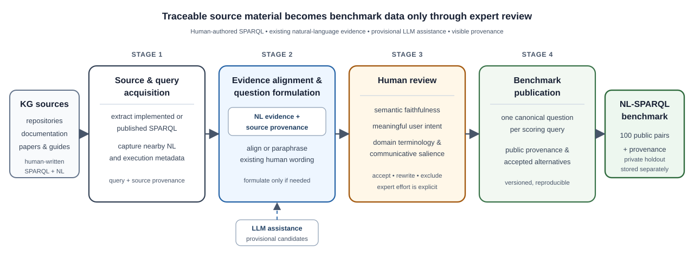

# Musparql: A Human-Curated NL-SPARQL Benchmark Workflow for Domain Knowledge Graphs

**Authors:** TODO
**Target venue:** Sci-K 2026, full research/data paper
**Artifact:** TODO repository/archive URL and DOI
**License:** TODO dataset/software license

## Abstract

Natural-language interfaces can make knowledge graphs accessible to researchers who are not Semantic Web specialists, but evaluating such interfaces requires trustworthy natural-language/SPARQL pairs. Existing benchmarks largely concern general-purpose graphs and seldom expose how source evidence, model assistance, and expert judgment contribute to benchmark construction. We present Musparql, a domain-agnostic workflow for curating NL-SPARQL evaluation data and instantiate it on music knowledge graphs. The workflow collects real SPARQL queries published in repositories, papers, and guides; retrieves existing human-authored natural-language evidence; uses an LLM to align that evidence or formulate a question when necessary; and subjects every resulting pair to human review. The LLM does not invent benchmark queries, and its proposed wording becomes scoring data only after review. The resulting public snapshot contains 100 NL-SPARQL pairs from five heterogeneous sources: 100 Years of Jazz, Musical Meetups, Organs, Music On the Web (MusOW), and LinkedMusic. Each scoring record remains traceable to its query source, supporting evidence, formulation process, and review decision. Musparql shows how expert effort can be made strategic and visible: automation gathers and organises candidate material, while domain experts concentrate on the semantic and pragmatic decisions that cannot be established by execution or surface fluency alone.

**Keywords:** NL-SPARQL, knowledge graph question answering, benchmark curation, human-in-the-loop evaluation, research knowledge graphs, music knowledge graphs

## 1. Introduction

SPARQL endpoints provide precise access to structured knowledge, yet they remain difficult to use for researchers who are specialists in a subject rather than in Semantic Web technologies [1]. This barrier is particularly relevant in non-technical disciplines such as musicology: researchers must learn not only a query language, but also the terminology and modelling choices of an unfamiliar data representation. Familiar words can acquire a narrower or different technical meaning. For example, a graph may represent an album through the Music Ontology class `Release`; a literal question about “releases” may reflect the ontology while sounding unnatural or suggesting a different concept to a musicologist [2]. Natural-language interfaces can mediate this gap by translating researchers' questions into SPARQL, explaining results, or supporting exploration of unfamiliar graph schemas.

Evaluating such interfaces requires more than syntactically valid queries. Benchmark examples must express plausible information needs, use appropriate domain terminology, and faithfully relate a graph pattern to a question that a researcher might ask. Most established NL-SPARQL and knowledge graph question-answering benchmarks are built around general-purpose graphs such as DBpedia or Wikidata [3–5]. They do not fully represent the conditions of smaller domain knowledge graphs, where documentation is heterogeneous, examples are dispersed across repositories and papers, endpoints may be unstable, and the usefulness of a formulation depends on specialist knowledge.

The resulting methodological problem is how to turn scattered, real-world query material into trustworthy evaluation data without obscuring the interpretation involved. A SPARQL query may be implemented in a repository while the corresponding information need appears in a competency-question table, a paper, or nearby documentation. Establishing the pair may require alignment and reformulation rather than simple extraction. Its provenance should therefore show whether the wording was directly paired with the query, aligned from other source evidence, formulated with model assistance, or rewritten by a reviewer.

Musparql addresses this curation problem through a domain-agnostic workflow for producing NL-SPARQL pairs from existing knowledge graph sources. Musicology supplies the empirical testbed, which spans performances, musical sources, jazz discographies, organs as both historical instruments and complex building projects, surveys of online music resources and ethnomusicological field recordings. The need is broader: many research domains require evaluation data for natural-language access but possess only scattered examples, uneven documentation, and limited expert time.

The paper contributes a reproducible human-in-the-loop method, a public snapshot of 100 curated pairs from five music knowledge graph sources, and an artifact model that keeps scoring data distinct from provenance, accepted rephrasings, review history, and any future private holdout. Together, these contributions make the intervention of domain experts both auditable and strategically focused.

## 2. Related Work and Motivation

Evaluation has been central to question answering over RDF knowledge graphs because a natural-language interface must bridge both a formal query language and the vocabulary of a particular graph. The QALD campaigns established shared evaluation for this task, while LC-QuAD and LC-QuAD 2.0 supplied larger collections of complex question–SPARQL pairs for data-driven systems [3–5]. Together with surveys of semantic question answering [6, 7], these resources define the technical setting of Musparql. They are not, however, its principal methodological precedent: they mainly support system comparison over large general-purpose graphs, whereas our concern is how reliable evaluation material can be recovered for smaller, heterogeneous domain knowledge graphs.

That distinction matters because benchmark results reflect the construction and maintenance of the benchmark as well as the capability of the system under test. Analyses of KGQA datasets have identified restricted query diversity, dependence on outdated or discontinued graph versions, changing endpoint results, and weak generalisation beyond the dataset on which a system was developed [8, 9]. QALD-10 responds to part of this problem by pairing its Wikidata benchmark with a stable graph snapshot and endpoint [10]. More recent evaluation campaigns have also moved towards particular knowledge settings: Scholarly-QALD 2023 evaluated question answering over the DBLP and Open Research Knowledge Graphs [11], and the TEXT2SPARQL challenges in 2025 and 2026 combined general-purpose evaluation with previously unseen organisational data [12, 13]. The 2026 edition additionally solicited datasets for custom and low-resource domain graphs. These developments substantiate the need for evaluation resources that are grounded in the schemas, terminology, and information needs of individual research communities rather than transferred only from DBpedia or Wikidata.

Recent datasets have begun to address realism in the provenance of questions and queries. SPINACH derives expert-annotated pairs from requests posted to Wikidata's `Request a Query` forum, retaining information needs that arose before benchmark construction [14]. The Wikidata Query Logs dataset instead begins with queries issued to the public endpoint and uses an agentic process to repair anonymised queries and generate corresponding questions [15]. Particularly close to our motivation is the collection by Bolleman et al. [16], which standardises more than one thousand human-written questions and SPARQL queries accumulated across multiple bioinformatics groups and endpoints, including federated examples. These resources show that realistic NL–SPARQL material can be recovered from operational or project activity. Musparql addresses a less uniform case: useful queries, descriptions, and competency questions are dispersed through repositories, papers, guides, and project websites, and the correspondence between them is not always already stated.

Competency questions provide an important bridge between knowledge-graph engineering and benchmark construction. They express the information needs that an ontology or graph is intended to support, but they are rarely published together with executable formal queries. Wiśniewski et al. [17] collected competency questions and their SPARQL-OWL translations across several ontologies and showed that linguistic question patterns and formal query structures do not have a one-to-one relationship. Q2Forge more recently introduced an LLM-assisted, human-refined workflow that generates competency questions and their SPARQL translations for a target graph [18]. Musparql solves the complementary problem. It does not generate benchmark queries: it begins with SPARQL implemented or published by people, seeks existing source-authored language before formulating new wording, and asks a reviewer to determine whether the resulting pair expresses a meaningful domain information need.

The need for this final judgment is especially visible in research and cultural-heritage graphs. Their technical vocabularies encode modelling decisions, while a useful question must also make sense in the language and practices of a domain. The closest system-oriented precedent is SESEMMI for LinkedMusic, which evaluated five LLMs on twenty manually constructed NL–SPARQL pairs spanning single-database and cross-database questions over an integrated music data lake [19]. Its sharp decline in accuracy as queries crossed databases demonstrates both the demand for music-domain evaluation and the difficulty of communicating heterogeneous graph structures to models. Musparql addresses the complementary upstream question of how evaluation pairs can be found, repaired, contextualised, and reviewed across independently developed graphs. Within music heritage, the Polifonia Ontology Network was itself developed through competency questions contributed by diverse pilots, including questions subsequently represented in the Musical Meetups graph used here [20]. A formally faithful verbalisation can nevertheless be misleading to a musicologist, and an executable query can be an administrative or intermediate operation rather than a plausible research question. The task is therefore not merely to translate between two strings, but to mediate between graph semantics, source evidence, and communicative intent.

LLMs make that mediation more tractable without making it automatic. They can search heterogeneous evidence, propose alignments, and verbalise a query for which no suitable wording is found, but fluent text does not establish semantic or pragmatic adequacy. Hybrid human–AI validation has likewise been shown to improve the quality of automatically constructed scientific knowledge graphs [21]. Musparql applies this principle to the construction of evaluation data and makes the intervention itself inspectable. Its primary contribution relative to previous NL–SPARQL collections is therefore not scale, but an auditable workflow in which source evidence, model assistance, execution evidence, reviewer interpretation, and the published canonical pair remain distinguishable.

## 3. Workflow

Musparql separates source evidence, model assistance, human judgment, and benchmark publication. The separation is methodological: it prevents generated text from being mistaken for source evidence, prevents execution success from being mistaken for benchmark suitability, and preserves the expert decisions that produce the scoring data. Figure 1 organises the process into four stages, with heterogeneous KG sources as input and a versioned benchmark as output.

**Figure 1:** The four-stage Musparql workflow. Human-authored SPARQL is collected with source provenance; existing natural-language evidence is aligned before new wording is formulated; expert review determines semantic and communicative adequacy; and publication separates compact scoring pairs from richer provenance. LLM assistance is confined to Stage 2 and cannot publish a benchmark item without Stage 3.

### 3.1 Source and Query Acquisition

The workflow begins by collecting SPARQL that people have implemented in repositories or published in papers, documentation, and guides. Musparql does not invent queries for the benchmark. Query extraction preserves the repository or document location, revision information where available, and a normalised hash. The same acquisition layer captures nearby comments, prose descriptions, competency questions, table entries, and other human-readable evidence.

The result is an inclusive candidate catalogue. Real-world collections contain user-facing examples alongside administrative queries, intermediate analytical steps, fragments, and queries whose assumptions are only intelligible within a particular application. Retaining this variety at acquisition time makes the source record complete; deciding which items support meaningful natural-language evaluation is deferred to review.

### 3.2 Evidence Alignment and Question Formulation

The second stage attempts to connect each candidate query to language already written by the source authors. Evidence may occur next to the query as a comment or description, elsewhere in the same project's competency-question list, in a paper, or as a source-authored prompt explicitly paired with a published query example. Competency questions are commonly used to state ontology requirements and to assess whether a graph supports the intended information needs [22]. Aligning them with implemented queries therefore reuses human formulations that have already played an evaluative role in the source project. More generally, this stage recovers NL-SPARQL material that is present in domain projects but not packaged as a benchmark.

The LLM performs two different tasks within this stage. Where suitable wording exists, it ranks and aligns the evidence to the SPARQL and may propose a faithful paraphrase. Where no suitable wording exists, it formulates a candidate question from the query and available graph context. In either case, the output records its mode and cited evidence and remains provisional until review. Thus the model helps convert scattered source material into reviewable candidates; it neither supplies the SPARQL nor independently establishes gold wording.

Execution results provide an additional diagnostic signal. Queries are submitted to configured endpoints or local dumps and their status, result count, timing, and errors are recorded. Execution is not an inclusion rule: a query can run while representing only an intermediate technical operation, whereas a meaningful pair may be temporarily unexecutable because a live endpoint is unavailable or a federated service times out. Pair validity and current endpoint availability are therefore assessed separately.

### 3.3 Human Review

Human review determines whether a candidate expresses a meaningful information need, whether the natural-language formulation is faithful to the graph pattern, and whether a canonical rewrite is required. It also acts as a semantic filter: a reviewer decides which query operations and returned variables express the information need and which serve only a technical or presentational function. Making this distinction often requires knowledge of both the research domain and the particular graph. Reviewers can accept, correct, or dismiss a pair, distinguish model problems from source-data problems, retain acceptable alternative formulations, and designate material for a future private holdout. Section 4 examines this interpretive work in detail.

### 3.4 Benchmark Publication

A versioned snapshot publishes one canonical question for each scoring query. The compact scoring file is accompanied by public provenance that records source evidence, review origin, and accepted non-canonical formulations. This division keeps evaluation simple without erasing how a pair was constructed.

Private holdout material follows a different lifecycle. Every candidate has already been processed by the generation model before review, including a candidate that is subsequently marked for holdout. The mechanism therefore does not keep the SPARQL or the model-generated formulation unseen. Instead, it stores the reviewer decision and any reviewer-authored canonical rephrasing separately from the public benchmark and provenance sidecar and excludes them from later prompt development and routine automatic evaluation. This prevents direct tuning against the private gold judgment and wording. The current snapshot contains no holdout records; the infrastructure is in place, but constructing controlled, domain-specific holdouts remains future work.

## 4. Human Review as Interpretive Mediation

Human review is not a final proofreading step but the point at which formal graph operations are interpreted as communicative questions. The observations below are documented cases from successive Musparql review rounds. They show why a benchmark cannot be derived from execution status or literal query verbalisation alone.

### 4.1 Initial and Comparative Review

Musparql supports two review modes. **Initial review** presents a previously unreviewed candidate together with its SPARQL, source evidence, execution metadata, and model rationale. The reviewer accepts, rewrites, or dismisses the pair and can record a literal formulation and alternative acceptable wording. **Comparative review** is used after a change to the evidence, prompt, model, or extraction pipeline. It places the previous and current candidates side by side so that the reviewer can decide whether the change warrants a benchmark update while retaining the earlier decision as provenance. The second mode has been important to the evolution of the benchmark through seven versions, because it distinguishes targeted reconsideration from rebuilding the benchmark after every experiment.

<!-- TODO: Insert Figure 2 with screenshots of the initial and comparative review interfaces. -->

**Figure 2 (planned):** Initial and comparative review interfaces. The initial view supports the first benchmark decision and canonical rewrite; the comparative view places previous and current candidates side by side after a change of model, prompt, evidence, or extraction. Both views expose the SPARQL and provenance required to assess semantic faithfulness.

### 4.2 Mismatches Observed in Review

The first recurring mismatch concerns ontology terminology and domain vocabulary. One reviewed query uses the Music Ontology class `Release` because publication dates and distinctions between manifestations are represented at release level. A literal verbalisation asks which “releases associated with performer X were published in 1965.” Where the graph context establishes that the relevant releases are albums, “Which albums by performer X were released in 1965?” is more natural and closer to the musicological concept. The rewrite is not a lexical simplification that can be made mechanically: without knowledge of the graph and collection, substituting “album” for every `Release` could narrow the query incorrectly.

A second mismatch arises between computational operations and communicative salience. A query may count encounters by place, order the groups, and return the two highest-ranked places together with their counts. The counts can be the semantic core of a question—“How many encounters occurred at each of the two most frequent places?”—or merely the mechanism used to identify the places—“Where did most encounters occur?” The SPARQL structure alone does not determine which reading reflects the source information need. Review and reformulation decide whether aggregation, ordering, and returned helper values belong in the canonical question.

Third, provenance fields do not have a uniform communicative role. A Musical Meetups query may return an excerpt labelled as evidence alongside the participants, time, place, and purpose of an encounter. If the excerpt is routinely included to trace graph statements back to a source, asking for “the supporting evidence text” may overload the question with implementation detail. In a query concerned with the documentary basis of a historical claim, however, the same field is central. Determining whether to mention it requires knowledge of how evidence is modelled and used in that graph.

Finally, the operational mechanism encoded in SPARQL may differ from the concept a researcher would name. A literal question about pairs of audio signals with the same short fingerprint accurately describes the graph pattern, whereas “Are there duplicate tracks in the dataset?” expresses its likely purpose. The latter is communicatively stronger but introduces an interpretation: matching fingerprints are being treated as evidence of duplication. A reviewer must decide whether the domain and data justify that inference.

### 4.3 Literal Meaning, Pragmatic Intent, and Ambiguity

These cases distinguish three forms of adequacy: preservation of formal graph semantics, expression of the relevant domain concept, and suitability as a human question. To describe the movement from literal to preferred formulations, the review interface introduced three exploratory linguistic dimensions. **Naturalness** ranges from awkward or formal wording to fluent human phrasing. **Pragmatism** ranges from exhaustive verbalisation of query structure to concise expression of communicatively salient content. **Room for interpretation** records how constrained or open a formulation is; unlike naturalness, more is not necessarily better, because openness may represent either useful conceptual breadth or harmful underspecification.

Experience with the review interface indicates that these dimensions are difficult to interpret as absolute ratings. They are better applied pairwise, comparing a literal query description with a preferred canonical formulation. Musparql therefore publishes human-accepted alternative wordings and explicitly marks literal query descriptions as such, but keeps the current exploratory ratings internal rather than treating them as benchmark data. A future annotation study will define the direction and comparison target of each dimension and measure reviewer agreement.

## 5. Benchmark Snapshot

The current public snapshot, `benchmark/v7`, was built on 14 July 2026 and contains 100 scoring records. Every record is included in the benchmark and its canonical natural-language formulation was confirmed by a human reviewer. The sources were chosen to provide a heterogeneous domain testbed: they differ in project history, documentation style, graph schema, query provenance, and degree of natural-language support; both small specialised graphs and large federated graphs are included. Our expertise domain is music, while the method is domain agnostic. Table 1 describes the published pairs and their provenance.

All five sources are published research artefacts rather than graphs constructed for this benchmark. Musical Meetups represents documentary evidence of historical encounters between musical figures [23]. DTL1000 draws on the Jazz Ontology and its large linked jazz discography repositories [24], while MusOW catalogues music-related datasets and digital resources available on the Web [25]. The Organs graph is one of the research pilots modelled by the Polifonia Ontology Network, whose Organs module represents instruments, their components, locations, and changes over time [20]. The LinkedMusic contribution differs in provenance: its twenty questions are the complete manually constructed evaluation set published with SESEMMI [19]. Musparql retains those source-authored prompts and records the subsequent repair and testing of their accompanying SPARQL.

| KG source | Pairs | Direct source wording | Evidence-aligned | Generated |
| --- | ---: | ---: | ---: | ---: |
| Musical Meetups | 30 | 0 | 20 | 10 |
| 100 Years of Jazz (DTL1000) | 21 | 0 | 10 | 11 |
| Music On the Web (MusOW) | 20 | 0 | 18 | 2 |
| LinkedMusic | 20 | 20 | 0 | 0 |
| Organs | 9 | 0 | 4 | 5 |
| **Total** | **100** | **20** | **52** | **28** |

**Table 1:** Benchmark coverage and origin of the initial natural-language candidate. “Direct source wording” denotes a human-authored prompt already paired with the query example; “evidence-aligned” combines candidates that reproduce or paraphrase cited source evidence; “generated” denotes candidates formulated without a selected source wording.

Table 2 isolates the effect of human review by separating the provenance of the initial candidate from the source of the final canonical question.

| Initial NL candidate | Retained as canonical | Reviewer rewrite | Total |
| --- | ---: | ---: | ---: |
| Direct source prompt | 20 | 0 | 20 |
| Aligned verbatim | 5 | 3 | 8 |
| Aligned paraphrase | 18 | 26 | 44 |
| Generated | 9 | 19 | 28 |
| **Total** | **52** | **48** | **100** |

**Table 2:** Effect of human review on the canonical question. “Retained” comprises 20 source prompts and 32 approved model outputs. “Aligned” denotes an LLM candidate grounded in cited source evidence; “generated” denotes a candidate formulated from the SPARQL and graph context because no suitable wording was selected. Counts are derived from the stored `nl_question_origin` and gold-question provenance.

Together, Tables 1 and 2 show that 72 of the 100 initial questions were grounded in human-authored source language: 20 were already paired with a query and 52 were aligned from evidence. Only 28 required generation without a selected source formulation. Human review still made a substantial contribution, replacing 48 candidates, including 29 evidence-aligned formulations and 19 generated ones.

The two largest source-specific interventions illustrate why question and query provenance must be recorded independently. The LinkedMusic prompts were retained, but all published SPARQL examples initially failed and were manually corrected before testing against the endpoint; some federated queries were accepted by the endpoint but still timed out because of external-service limits. In MusOW, by contrast, the SPARQL was retained from the source while natural-language descriptions from the survey documentation were aligned to individual queries and, where necessary, rewritten during review. Both cases produce valid benchmark pairs, but by different curation paths.

## 6. Reproducibility, Iteration, and Artifact Design

The artifact mirrors the conceptual separation of the workflow. Source snapshots and extracted query records establish what existed before model assistance. Frozen generation runs record the prompt, model, evidence citations, and proposed formulation. Review exports capture the expert decision, notes, and rewrite. A benchmark build then derives a versioned scoring file and public provenance from those records without allowing automatic evaluation to update the benchmark itself.

This separation also permits changes to one pipeline component to be evaluated without silently changing the benchmark. In one controlled experiment, adding explicit ontology-term and observed graph-shape context reduced the mean automatic semantic score on a five-point scale from 4.433 to 4.066 and produced questions that were closer to data-model terminology or unnecessarily specific; comparative review did not support adopting the enrichment. A later comparative review, documented in the artifact (`experiments/2026-05-28-minimax-comparison.md`), found MiniMax-M2.5 sufficiently competitive with OpenAI's `gpt-5-2025-08-07` for candidate formulation and often more natural or pragmatic, but also identified omitted constraints and systematic evidence-ID drift. MiniMax-M2.5 was adopted only with citation validation and continued human review. These experiments are evidence about pipeline design rather than a general model ranking: repeated review also revealed changes in the reviewer's own understanding of particular graphs.

This structure supports different uses without requiring every user to process the complete history. A model developer can use the compact pairs for regression testing, prompt or model comparison, error analysis, and few-shot examples. A curator can inspect the source evidence and review trail for a disputed item or construct a new snapshot without silently replacing earlier decisions. Accepted alternatives can support analyses that recognise more than one semantically adequate wording, while the single canonical question preserves compatibility with conventional scoring procedures.

The artifact also makes the boundary between public development data and independent evaluation explicit. Public examples are deliberately inspectable and reproducible; they should be assumed visible to model developers and potentially to models themselves. The repository can withhold reviewer judgments and canonical rewrites in a separate reviewer-only file, but the present release contains no such private gold set. As noted in Section 3.4, this mechanism hides the human gold decision rather than the candidate query that was already supplied to the generation model.

TODO: Add the repository URL, archived release DOI, code and data licences, public-artifact contents, and any restrictions on redistributing raw model outputs. Sci-K requests DOI-bearing data or software artifacts for reproducibility.

## 7. Discussion and Future Work

Musparql demonstrates how a domain-grounded curation process can produce reusable evaluation data for natural-language access to heterogeneous research knowledge graphs. Music provides a demanding setting because schemas and documentation vary, federated queries cross institutional boundaries, and the relationship between a graph operation and a research question often requires specialist interpretation. Comparable conditions occur in other domains where structured resources are valuable but evaluation material for natural-language access is scarce. The transferable contribution is therefore not only a music query collection, but a method for turning dispersed human work into traceable evaluation data while applying expert judgment at points of genuine semantic uncertainty.

The snapshot's modest size should be interpreted in this context. It is not intended for training at scale; its intended uses include few-shot prompting, regression testing, controlled comparisons, and qualitative error analysis. More importantly, the artifact reveals what scale alone conceals: whether the wording is source-derived, model-assisted, or reviewer-mediated; what evidence supports it; and where expert intervention changed the apparent meaning of a query.

Three limitations delimit the present claims. First, the empirical results come from one domain and one principal reviewer, although they incorporate multiple initial and comparative review rounds across seven benchmark versions. Cross-domain transfer and reviewer consistency have therefore not yet been measured. Second, no controlled holdout has yet been constructed for independent evaluation, although the data model and review workflow support one. Third, execution remains dependent on live and federated services for some examples; recorded execution metadata improves diagnosis but cannot guarantee future endpoint availability.

Future releases will address these limits by constructing per-domain holdouts whose reviewer judgments and canonical rephrasings are available only through controlled evaluation and are not released on the public Web or used for model and prompt development; measuring intra- and inter-reviewer consistency; and extending the collection to additional domains, languages, and types of ambiguity. We will also evaluate current text-to-SPARQL systems on Musparql's executable subset, initially through the TEXT2SPARQL pipeline [12], using execution-based scoring together with error analysis that distinguishes model failures from query-template, graph-version, endpoint, and federated-service failures. Pairwise comparison with literal NL descriptions will support more precise study of naturalness, pragmatism, communicative salience, and interpretive openness without conflating those dimensions with benchmark correctness. On the acquisition side, KG and source discovery can be augmented by LLMs. These developments retain the central design principle: automation should enlarge and organise the evidence base, while expert effort remains visible and is reserved for decisions that require domain interpretation.

## Acknowledgments

TODO: Add funding/project acknowledgments. Possible candidates: GRAPHIA, Polifonia, NFDI4Culture, and LinkedMusic as appropriate; distinguish project support from acknowledgment of data sources.

## Declaration on Generative AI

TODO: Finalize according to the CEUR-WS policy [26] and the actual writing process. Draft version:

During preparation of this manuscript, the author used OpenAI Codex/ChatGPT for drafting support, code inspection, and summarisation of project artifacts. The author reviewed, edited, and takes responsibility for all content.

## References

1. S. Harris, A. Seaborne (Eds.), *SPARQL 1.1 Query Language*, W3C Recommendation, 2013. <https://www.w3.org/TR/sparql11-query/>.
2. Y. Raimond, S. A. Abdallah, M. B. Sandler, F. Giasson, The Music Ontology, in: *Proceedings of ISMIR 2007*, Austrian Computer Society, 2007, pp. 417–422. <https://ismir2007.ismir.net/proceedings/ISMIR2007_p417_raimond.pdf>.
3. V. Lopez, C. Unger, P. Cimiano, E. Motta, Evaluating question answering over linked data, *Journal of Web Semantics* 21 (2013) 3–13. <https://doi.org/10.1016/j.websem.2013.05.006>.
4. P. Trivedi, G. Maheshwari, M. Dubey, J. Lehmann, LC-QuAD: A corpus for complex question answering over knowledge graphs, in: *The Semantic Web – ISWC 2017*, LNCS 10587, Springer, 2017, pp. 210–218. <https://doi.org/10.1007/978-3-319-68204-4_22>.
5. M. Dubey, D. Banerjee, A. Abdelkawi, J. Lehmann, LC-QuAD 2.0: A large dataset for complex question answering over Wikidata and DBpedia, in: *The Semantic Web – ISWC 2019*, LNCS 11779, Springer, 2019, pp. 69–78. <https://doi.org/10.1007/978-3-030-30796-7_5>.
6. K. Höffner, S. Walter, E. Marx, R. Usbeck, J. Lehmann, A.-C. Ngonga Ngomo, Survey on challenges of question answering in the Semantic Web, *Semantic Web* 8 (2017) 895–920. <https://doi.org/10.3233/SW-160247>.
7. D. Diefenbach, V. Lopez, K. Singh, P. Maret, Core techniques of question answering systems over knowledge bases: A survey, *Knowledge and Information Systems* 55 (2018) 529–569. <https://doi.org/10.1007/s10115-017-1100-y>.
8. N. Steinmetz, K.-U. Sattler, What is in the KGQA benchmark datasets? Survey on challenges in datasets for question answering on knowledge graphs, *Journal on Data Semantics* 10 (2021) 241–265. <https://doi.org/10.1007/s13740-021-00128-9>.
9. L. Jiang, R. Usbeck, Knowledge graph question answering datasets and their generalizability: Are they enough for future research?, arXiv:2205.06573, 2022. <https://doi.org/10.48550/arXiv.2205.06573>.
10. R. Usbeck, X. Yan, A. Perevalov, L. Jiang, J. Schulz, A. Kraft, C. Möller, J. Huang, J. Reineke, A.-C. Ngonga Ngomo, M. Saleem, A. Both, QALD-10—the 10th challenge on question answering over linked data, *Semantic Web* (2023) 1–15. <https://doi.org/10.3233/SW-233471>.
11. D. Banerjee, R. Usbeck, N. Mihindukulasooriya, M. Y. Jaradeh, S. Auer, G. Singh, R. Mutharaju, P. Kapanipathi (Eds.), *Joint Proceedings of Scholarly QALD 2023 and SemREC 2023*, CEUR Workshop Proceedings 3592, 2023. <https://ceur-ws.org/Vol-3592/>.
12. S. Tramp, M. Gôlo, E. Marx, P. Viviurka do Carmo (Eds.), *Proceedings of the First International TEXT2SPARQL Challenge*, CEUR Workshop Proceedings 4094, 2025. <https://ceur-ws.org/Vol-4094/>.
13. TEXT2SPARQL, *Second International TEXT2SPARQL Challenge: Dataset Participation*, 2026. <https://text2sparql.aksw.org/2026/participation/datasets/> (accessed 2 August 2026).
14. S. Liu, S. Semnani, H. Triedman, J. Xu, I. D. Zhao, M. Lam, SPINACH: SPARQL-based information navigation for challenging real-world questions, in: *Findings of the Association for Computational Linguistics: EMNLP 2024*, 2024, pp. 15977–16001. <https://doi.org/10.18653/v1/2024.findings-emnlp.938>.
15. S. Walter, H. Bast, The Wikidata Query Logs dataset, in: *Proceedings of SIGIR 2026*, 2026, arXiv:2602.14594. <https://doi.org/10.48550/arXiv.2602.14594>.
16. J. Bolleman, V. Emonet, A. Altenhoff, et al., A large collection of bioinformatics question–query pairs over federated knowledge graphs: Methodology and applications, *GigaScience* 14 (2025) giaf045. <https://doi.org/10.1093/gigascience/giaf045>.
17. D. Wiśniewski, J. Potoniec, A. Ławrynowicz, C. M. Keet, Analysis of ontology competency questions and their formalizations in SPARQL-OWL, *Journal of Web Semantics* 59 (2019) 100534. <https://doi.org/10.1016/j.websem.2019.100534>.
18. Y. Taghzouti, F. Michel, T. Jiang, L.-F. Nothias, F. Gandon, Q²Forge: Minting competency questions and SPARQL queries for question-answering over knowledge graphs, in: *Proceedings of K-CAP 2025*, ACM, 2025. <https://doi.org/10.1145/3731443.3771350>.
19. L. Pond, L. Kirby, S. Meng, S. Ngassam, S. Chow, D. Hillerbrand, I. Fujinaga, SESEMMI for LinkedMusic: Democratizing access to musical archives via large language models, in: *LLM4Music at ISMIR 2025*, 2025. <https://openreview.net/forum?id=hSDeNeUzcy>.
20. J. de Berardinis, V. A. Carriero, N. Jain, N. Lazzari, A. Meroño-Peñuela, A. Poltronieri, V. Presutti, The Polifonia Ontology Network: Building a semantic backbone for musical heritage, in: *The Semantic Web – ISWC 2023*, Springer, 2023, pp. 302–322. <https://doi.org/10.1007/978-3-031-47243-5_17>.
21. S. Tsaneva, D. Dessì, F. Osborne, M. Sabou, Enhancing scientific knowledge graph generation pipelines with LLMs and human-in-the-loop, in: *Proceedings of Sci-K 2024*, CEUR Workshop Proceedings 3780, 2024. <https://ceur-ws.org/Vol-3780/paper1.pdf>.
22. M. Grüninger, M. S. Fox, The role of competency questions in enterprise engineering, in: *Benchmarking—Theory and Practice*, Springer, 1995, pp. 22–31. <https://doi.org/10.1007/978-0-387-34847-6_3>.
23. A. Morales Tirado, J. Carvalho, M. Ratta, C. Uwasomba, P. Mulholland, H. Barlow, T. Herbert, E. Daga, Musical Meetups Knowledge Graph (MMKG): A collection of evidence for historical social network analysis, in: *The Semantic Web – ESWC 2024*, Springer, 2024, pp. 110–127. <https://doi.org/10.1007/978-3-031-60635-9_7>.
24. P. Proutskova, D. Wolff, G. Fazekas, K. Frieler, F. Höger, O. Velichkina, G. Solis, T. Weyde, M. Pfleiderer, H. C. Crayencour, G. Peeters, S. Dixon, The Jazz Ontology: A semantic model and large-scale RDF repositories for jazz, *Journal of Web Semantics* 74 (2022) 100735. <https://doi.org/10.1016/j.websem.2022.100735>.
25. M. Daquino, E. Daga, M. d’Aquin, A. Gangemi, S. Holland, R. Laney, A. Meroño-Peñuela, P. Mulholland, Characterizing the landscape of musical data on the Web: State of the art and challenges, in: *Proceedings of WHiSe II*, CEUR Workshop Proceedings 2014, 2017, pp. 57–68. <https://ceur-ws.org/Vol-2014/paper-07.pdf>.
26. A. A. Salatino, F. Fornari, J. Zdravkovic, *CEUR-WS Policy on AI-Assisting Tools*, 2025. <https://ceur-ws.org/GenAI/Policy.html> (accessed 2 August 2026).
